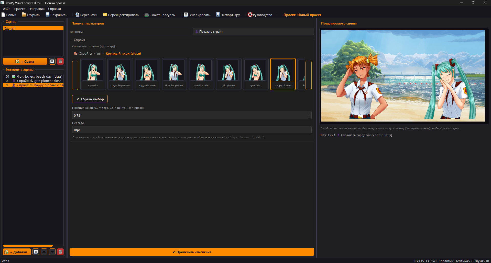

# RenPy Visual Script Editor

Визуальный редактор сценариев для **Ren'Py**, позволяющий создавать `.rpy`-сценарии без ручного написания кода.

Редактор ориентирован на разработку визуальных новелл и модификаций. Он позволяет собирать сцены из отдельных узлов, сразу видеть результат в предпросмотре и экспортировать готовый сценарий в формат Ren'Py.

---

## Возможности

* 🎬 Визуальное построение сценариев из узлов
* 👤 Работа с персонажами
* 💬 Диалоги и реплики рассказчика
* 🖼 Поддержка фонов, CG и спрайтов
* 🎵 Музыка и звуковые эффекты
* 📋 Меню выбора с поддержкой `jump` и `call`
* 🏷 Метки (`label`) и переходы (`jump`)
* ⏸ Паузы и Python-блоки
* 👀 Живой предпросмотр сцены
* 🖱 Перетаскивание спрайтов непосредственно в окне предпросмотра
* 📦 Автоматическая индексация ресурсов
* 🧩 Поддержка составных спрайтов (`sprites.rpy`)
* 📄 Генерация готового `.rpy`
* 📤 Экспорт блоков `define` и объявлений ресурсов

---

# Скриншоты



---

# Установка

## Готовая сборка

Скачайте последнюю версию из раздела **Releases**.

После распаковки структура должна выглядеть так:

```
RenPyVisualEditor/
│
├── RenPyVisualEditor.exe
├── resources/
├── characters.json
└── resources_config.json
```

---

## Запуск из исходников

```bash
pip install -r requirements.txt

python main.py
```

---

# Подготовка ресурсов

Редактор использует следующую структуру:

```
resources/
    default/
        bg/
        cg/
        sprites/
        music/
        sounds/

    custom/
        bg/
        cg/
        sprites/
        music/
        sounds/
```

Ресурсы из обеих папок используются одинаково при работе редактора.

При экспорте объявлений (`image`, `define`) учитываются только ресурсы из `custom`.

---

# Работа со спрайтами

Поддерживаются два типа спрайтов:

* обычные изображения;
* составные спрайты из `sprites.rpy`.

Составные спрайты автоматически распознаются и отображаются как полноценные изображения в окне предпросмотра.

---

# Предпросмотр сцены

Редактор отображает состояние сцены на выбранном узле:

* фон;
* CG;
* спрайты;
* текст;
* положение персонажей.

Можно:

* перетаскивать персонажей мышью;
* удалять спрайты прямо из окна предпросмотра;
* сразу видеть итоговый результат без запуска игры.

---

# Экспорт

Поддерживается экспорт:

* сценария `.rpy`;
* блока `define Character`;
* объявлений ресурсов (`image`, `define`).

---

# Сборка

Для создания исполняемого файла используется PyInstaller.

```
pip install pyinstaller

pyinstaller RenPyVisualEditor.spec
```

После сборки рядом с `RenPyVisualEditor.exe` должна находиться папка `resources`.

---

# Для кого этот редактор

Редактор подойдет:

* разработчикам визуальных новелл;
* авторам модификаций;
* начинающим разработчикам Ren'Py;
* сценаристам, которые не хотят вручную писать `.rpy`.

---

# Планы

* Undo / Redo
* Поиск по сценам
* Горячие клавиши
* Массовое редактирование узлов
* Поддержка пользовательских типов узлов
* Автосохранение
* Улучшение генератора кода

---

# Обратная связь

Discord:

https://discord.com/invite/XsCq2ndRGX

---

# Лицензия

Проект распространяется по лицензии MIT.
