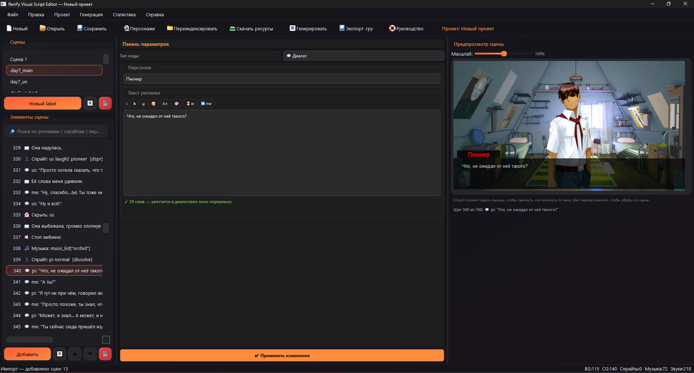
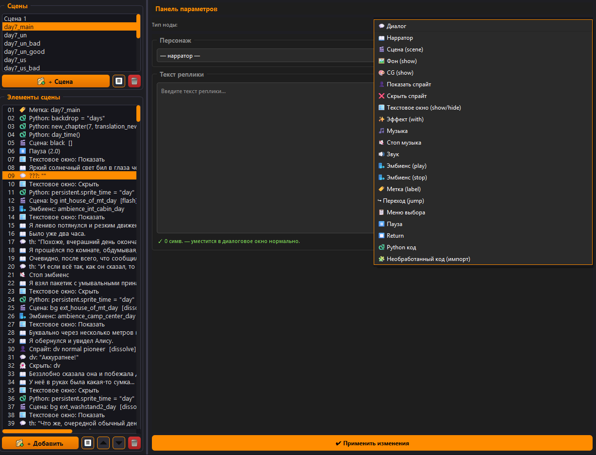
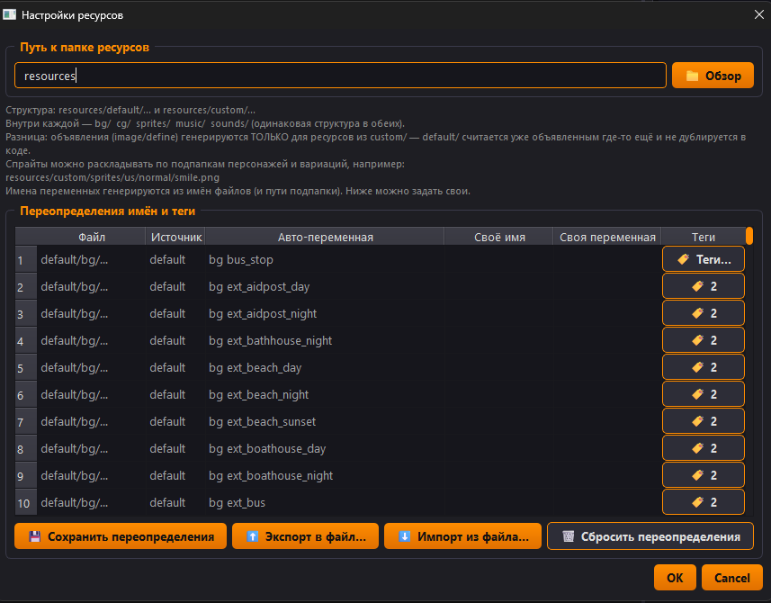
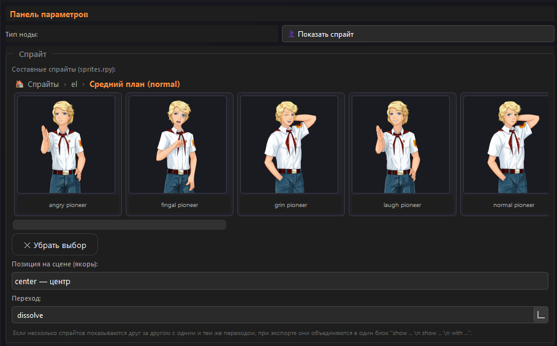
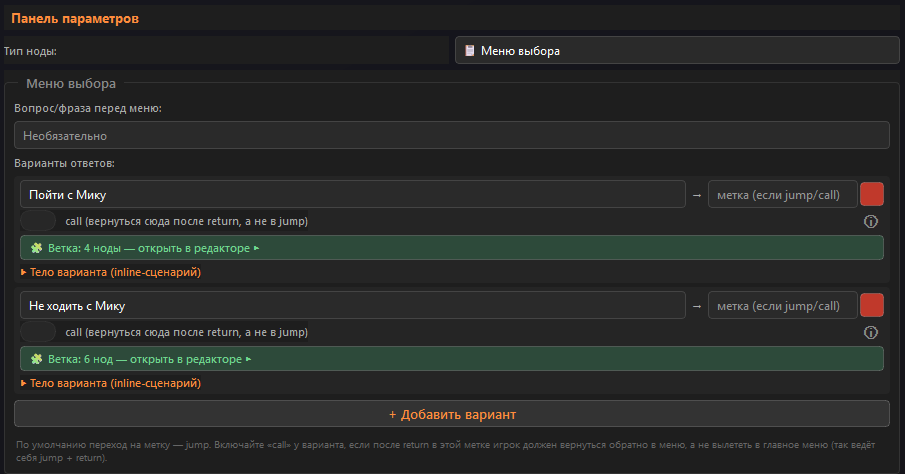
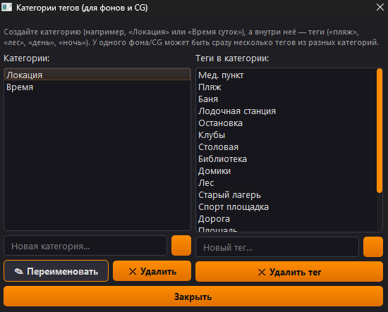
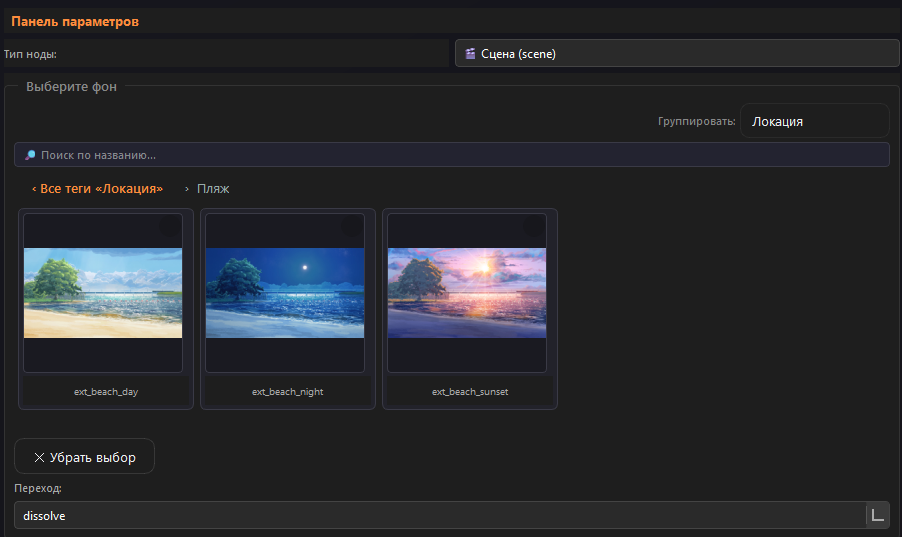
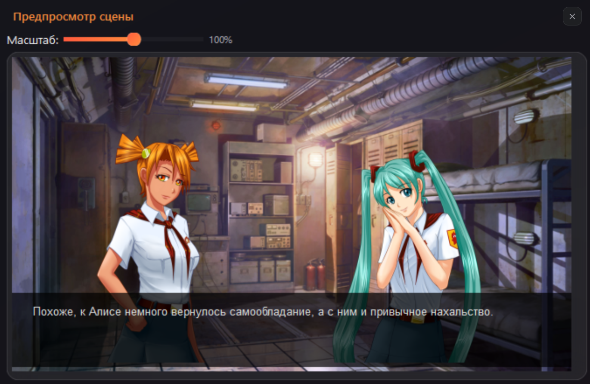

<h1 align="center">User Guide - RenPy Visual Script Editor</h1>

<p align="center">
  Complete documentation for the visual <strong>Ren'Py</strong> script editor.
</p>

<p align="center">
  <a href="../README.md">Русский</a> |
  <a href="../README_EN.md">English</a> |
  <a href="WIKI.md">Wiki (RU)</a> |
  <a href="WIKI_EN.md">Wiki (EN)</a>
</p>

---

## Table of contents

1. [Quick start](#1-quick-start)
2. [General structure](#2-general-structure)
3. [Resource folders](#3-resource-folders)
4. [Composite sprites](#4-composite-sprites-spritesrpy)
5. [Node types](#5-node-types)
6. [Tags & grouping](#6-tags--grouping)
7. [Scene preview](#7-scene-preview)
8. [Characters](#8-characters)
9. [Importing `.rpy` scripts](#9-importing-rpy-scripts)
10. [Generation & export](#10-generation--export)
11. [Hotkeys](#11-hotkeys)
12. [FAQ](#12-faq)
13. [How it works: features by version](#13-how-it-works-features-by-version)
14. [Version history](#14-version-history)

---

## 1. Quick start 🚀

### First launch

Create a new project via `File → New Project` (Ctrl+N).



> 🖼️ *Screenshot: main window. Left - scene & node list, center - node editor, right - live preview.*

### Preparing resources

Create a `resources/` folder next to the executable:

```
resources/
  custom/
    bg/          ← backgrounds (.jpg, .png)
    cg/          ← CG illustrations
    sprites/     ← sprites (character folders: sprites/us/normal/smile.png)
    music/       ← music (.ogg, .mp3)
    sounds/      ← sound effects
```

Assets in `default/` are usable in the editor but **not exported** in `define`/`image` blocks (assumed to be declared in the base game template).

### Typical flow

1. **Label** - chapter entry point
2. **Scene** - show background and clear sprites
3. **Music** - background track
4. **Show sprite** - place a character
5. **Dialogue** - spoken line



> 🖼️ *Screenshot: dropdown menu when clicking «+ Add Node».*

---

## 2. General structure 🗂️

- A **Project** contains **Scenes**. Each scene is a sequence of **Nodes**.
- A **Node** is a single action: show background, speak a line, play music, etc.
- Left panel - scene list and node list of the current scene.
- Center panel - editor for the selected node.
- Right panel - **live preview**: background, sprites, current dialogue line.

---

## 3. Resource folders 📦

### Two resource sources

| Folder | Purpose | Exported in define? |
|--------|---------|---------------------|
| `resources/default/` | Base template assets | ❌ No |
| `resources/custom/` | Your assets | ✅ Yes |

### Automatic names

| Category | Example file | Auto-generated name |
|----------|-------------|---------------------|
| Background | `bg/bus_stop.jpg` | `bg bus_stop` |
| CG | `cg/d1_food_normal.jpg` | `cg d1_food_normal` |
| Sprite | `sprites/us/normal/smile.png` | `us_normal_smile` |
| Music | `music/name.ogg` | `music_list["name"]` |
| Sound | `sounds/achievement.ogg` | `sfx_achievement` |

### Name overrides

`Project → Resource Settings → Name Overrides`

- **Save** - apply changes
- **Export / Import** - transfer override sets between projects
- **Reset** - delete all overrides (⚠️ irreversible)



> 🖼️ *Screenshot: resource settings window with the name override table.*

---

## 4. Composite sprites (sprites.rpy) 🧩

If a **sprites.rpy** file exists inside `resources/*/sprites/`, the editor parses character declarations from it and builds the sprite picker carousel from them. This is the **only** source of composite sprites: there is no automatic declaration or assembly from folder structure anymore (no `layeredimage`, no guessing from nested subfolders) - if a character isn't in `sprites.rpy`, it simply won't appear as a composite sprite in the editor, and its files (if any) stay as plain flat resources (see "Show sprite → Plain sprites").

**Parsing example:**
```renpy
image cs normal stethoscope far = ConditionSwitch(
    "persistent.sprite_time=='sunset'", im.MatrixColor(im.Composite((630,1080),
        (0,0), "sprites/far/cs/cs_1_body.png",
        (0,0), "sprites/far/cs/cs_1_stethoscope.png",
        (0,0), "sprites/far/cs/cs_1_normal.png"), im.matrix.tint(0.94, 0.82, 1.0)),
    ...
)
```

The parser also understands a simpler, single-line form (no `ConditionSwitch`/`im.MatrixColor`):
```renpy
image mt grin panama pioneer far = im.Composite((630,1080), (0,0), "sprites/far/mt/mt_3_body.png", (0,0), "sprites/far/mt/mt_3_panama.png", (0,0), "sprites/far/mt/mt_3_grin.png", (0,0), "sprites/far/mt/mt_3_pioneer.png")
```
Whatever the block looks like, only the final `im.Composite(...)` layer stack is extracted; conditional logic and tinting (`im.matrix.tint`, `AlphaMask`, etc.) are ignored while parsing - the editor only cares about the final composited layers.

### Sprite name: character, attributes, position

The name after `image` is parsed as follows:
- the **first word** is the character (`cs`, `mt`, `dv`...);
- the **last word**, if it's `far`/`close`/`normal`, is the position (shot distance); if there's no such word, the position defaults to `normal`;
- everything left in between is the **attributes** (there can be several).

### Attributes are independent groups, not one flat list

In `image cs normal stethoscope far`, `normal` and `stethoscope` are **two different, independently selectable attributes** (e.g. "facial expression" and "extra item"), not two variants of the same thing. The editor shows them separately - each word position in the name becomes its own row of attribute cards (like groups in a regular `layeredimage`, except they're inferred from the actual `sprites.rpy` declarations instead of being declared explicitly). Each attribute card shows the **entire** composited sprite (not just the single layer that changes).

Selecting multiple attributes looks for an **exact match** among the combinations actually declared in `sprites.rpy` - no non-existent layer combination is ever guessed or assembled on the fly.

### Optional accessory attributes (panama, glasses, etc.)

Sometimes some of a character's sprites have an extra, optional accessory inserted in the MIDDLE of the name (e.g. `mt grin panama pioneer far`, where normally there are only two attributes: emotion and clothing). Such a word would break the usual positional attribute grouping - it's split into its own optional group in two ways:

1. **Automatically** - if a word only occurs in combinations longer than the character's typical length, and never appears in a combination of the typical length, it's treated as an optional accessory.
2. **Via a hint** - an **`exceptions.txt`** file placed next to `sprites.rpy` (in the same `sprites/` folder). Format - one entry per line:
   ```
   # character: words that should always become a separate optional attribute
   mt: panama
   mz: glasses, sunglasses
   ```
   The separator after the character name is `:` (or just a space); words are separated by commas and/or spaces. Empty lines and lines starting with `#` are ignored.

Such an optional group is labeled in the UI as "Attribute N (optional)" - it can be left unselected.

### Compatible attribute highlighting

When an attribute is selected in one group (e.g. "dress"), attributes in other groups for which no declared sprite exists paired with the current selection (e.g. "smile", if only "smile + pioneer" exists and not "smile + dress") are visually dimmed - so you can immediately see which combinations actually exist in `sprites.rpy` without trial and error.

**Hiding:** `hide cs` is enough, not the full name with all attributes.



> 🖼️ *Screenshot: sprite carousel. Characters → position (if more than one) → rows of attribute cards with a full-sprite preview.*

---

## 5. Node types 🎬

| Node | Description | Generated example |
|------|-------------|-------------------|
| **Dialogue** | Character speech | `me "Text"` |
| **Narrator** | Text without a name | `"Text"` |
| **Scene** | Background + clear sprites | `scene bg bus_stop` |
| **Background (show)** | Change background only | `show bg bus_stop` |
| **CG** | Full-screen illustration | `show cg d1_food_normal` |
| **Show sprite** | Sprite with position & transition | `show un smile at left with dissolve` |
| **Hide sprite** | Hide specific sprite or whole character | `hide un` |
| **Text window** | Show/hide dialogue window | `window show` / `window hide` |
| **Effect (with)** | Standalone transition | `with dissolve` |
| **Music** | Play with fadein | `play music music_list["name"] fadein 2` |
| **Stop music** | Stop with fadeout | `stop music fadeout 3` |
| **Sound** | Sound effect | `play sound sfx_achievement` |
| **Ambience** | Environmental loops | `play ambience ...` / `stop ambience` |
| **Label** | Entry point | `label chapter_1:` |
| **Jump** | Jump to label | `jump chapter_2` |
| **Choice menu** | Branching menu | `menu:` |
| **Pause** | Click wait or timer | `pause` / `pause 2.0` |
| **Return** | Return from call | `return` |
| **Python code** | Arbitrary code | `$ flag = True` |
| **Raw code** | Unrecognized block (imported) | preserved verbatim |

### scene vs show

- **`scene`** - clears **all** sprites and CGs before showing the background. Use when changing location.
- **`show`** - changes only the background; characters stay on screen.

### Choice menu

Each option has:
- **Text** - what the player sees
- **Label** - where to jump/call
- **«call» checkbox** - default is `jump`; enable for `call` (returns after `return`)
- **Body** - inline Ren'Py code executed when chosen



> 🖼️ *Screenshot: choice menu node with three options, label fields, and call checkboxes.*

### Transitions

Built-in: `dissolve`, `fade`, `fade2`, `fade3`, `flash`, `pixellate`, `blinds`, `squares`, `wipeleft`, `wiperight`, `wipeup`, `wipedown`, `vpunch`, `hpunch`, `dspr`.

The field is editable: you can type a custom `define transform mytrans` name.

**Grouping:** if consecutive nodes share the same transition, they are exported with a single trailing `with`.

---

## 6. Tags & grouping 🏷️

`Project → Resource Tags`

1. Create a **category** (e.g., «Location»)
2. Add **tags** («beach», «school», «night»)
3. Assign tags to resources via right-click in the carousel
4. In the BG/CG node, select «Group by → Location»

Untagged resources appear under «No tag».



> 🖼️ *Screenshot: tag category editor adding a new «Time of Day» category.*



> 🖼️ *Screenshot: background carousel grouped by pseudo-folders «Location».*

---

## 7. Scene preview 👀

The right panel shows the scene state at the selected node:
- Background / CG
- All visible sprites
- Current dialogue line

**Interactive:**
- **Drag a sprite** - change `xalign` (horizontal position)
- **Click a sprite** - delete the node that showed it
- **Hover** - highlight with a «remove» tooltip

**Default anchors:** `left`, `cleft`, `center`, `cright`, `right`, `fleft`, `fright`.



> 🖼️ *Screenshot: preview window with a background, two character sprites, and a dialogue box.*

---

## 8. Characters 👤

`Project → Characters...` (Ctrl+P)

- **Name** - displayed in the UI
- **Variable** - written to `.rpy` (`me`, `th`, `un`)
- **Color** - name color in dialogue

**Buttons:**
- Export / Import character list as JSON
- Reset list

---

## 9. Importing `.rpy` scripts 🔄

`File → Import .rpy script`

**Recognized:**
- `scene`, `show`, `hide` (backgrounds, CGs, sprites)
- `window show` / `window hide`
- `with` (including grouped transitions)
- Dialogues and narration
- `play music`, `stop music`, `play sound`, `play ambience`
- `label`, `jump`, `call`, `return`, `pause`
- `menu:` with options and bodies
- `$ ...` and `python:` blocks
- Conditional blocks (`if`) - as RAW nodes

**Becomes RAW:**
- `show X:` with ATL block if `X` is unknown
- `init python`, `transform`, `screen`
- Any unrecognized constructs

---

## 10. Generation & export 📄

| Action | Hotkey | Result |
|--------|--------|--------|
| View code | Ctrl+G | Window with final `.rpy` |
| Export `.rpy` | Ctrl+E | Save script file |
| Export character defines | - | `define ... = Character(...)` |
| Export resource defines | - | `image ...` / `define ...` from `custom/` only |

---

## 11. Hotkeys ⌨️

| Keys | Action |
|------|--------|
| Ctrl+N | New project |
| Ctrl+O | Open project |
| Ctrl+S | Save |
| Ctrl+Shift+S | Save as |
| Ctrl+P | Characters |
| F5 | Re-index resources |
| Ctrl+G | View generated code |
| Ctrl+E | Export `.rpy` |
| Ctrl+C / Ctrl+V | Copy / paste nodes |
| Ctrl+Z / Ctrl+Y | Undo / redo |
| Ctrl+Shift+P | Command palette |

---

## 12. FAQ ❓

**Q: I added files to `resources/` but don't see them.**
A: Press F5 («Re-index resources») or restart the editor.

**Q: What's the difference between Scene and Background?**
A: `scene` clears all sprites; `show` only changes the background.

**Q: My composite sprite won't hide.**
A: Use the character name: `hide cs`, not the full emotion name.

**Q: A tag category doesn't appear in the CG node.**
A: Categories only appear where resources have those tags. Tag at least one CG.

**Q: `show X:` with ATL became RAW.**
A: If `X` isn't found in resources, the code is preserved verbatim. Make sure the file is in the correct folder and press F5.

---

## 13. How it works: features by version 🧭

### v1.5.2

- **sprites.rpy: composite sprite logic fully reworked** - removed
  `layeredimage` support (both reading it from files and auto-generating
  it) and removed auto-generation of composite sprites from folder
  structure for undeclared characters: the only source now is
  `sprites.rpy` - if it's missing, a character simply won't appear as a
  composite sprite (its files stay as plain flat resources).
- **Attributes are independent groups, not one flat list** - in a name
  like `image cs normal stethoscope far`, the words `normal` and
  `stethoscope` are now shown as two different, independently selectable
  attributes (like groups in a regular `layeredimage`), instead of being
  lumped into one pile. Each attribute card now previews the ENTIRE
  composited sprite, not just the single layer that differs.
- **Optional accessory attributes and `exceptions.txt`** - an extra
  accessory inserted in the middle of a name (e.g. `panama` in
  `mt grin panama pioneer far`) is now either auto-detected (by an
  atypical name length) or explicitly listed in an `exceptions.txt` file
  next to `sprites.rpy` - and split into its own optional attribute
  group, without breaking the positional grouping of the rest.
- **Compatible attribute highlighting** - selecting an attribute in one
  group visually dims incompatible options in other groups (ones with no
  actually declared combination).
- **Resource carousel width fixes** - the carousel no longer takes up
  more width than its content needs when there are few files/folders
  (e.g. a single character folder), while still filling the full
  available width when there are many items.
- **"Project" menu icon alignment** - icons for "Presentation Mode",
  "Timing Check" and "Spellcheck Lines" moved into the reserved icon area
  to the left of the label (like the rest of the menu), instead of being
  baked into the label text itself.

### v1.5.0

- **ATL transform parsing** - freeform ATL (Ren'Py Animation & Transform
  Language) text typed into a node's transform field is now recognized by
  the editor and broken down into readable steps (anchor, position,
  rotation, zoom, etc.) instead of staying an opaque text blob.
- **ATL animation emulation in preview** - parsed steps are played back
  right in the node's live preview, including looping via `repeat`. For
  example, this ATL:
  ```
  anchor (0.0, 0.0) pos (0.0, 0.0)
  linear 0.1 pos (-9, -7)
  linear 0.1 pos (0, 0)
  linear 0.1 pos (9, -7)
  linear 0.1 pos (0, 0)
  repeat
  ```
  plays back in the preview step by step, exactly as written, and loops.
- **Transition emulation and custom transitions** - besides the built-in
  transition set, there's now a live preview of any transition (including
  mask-based `ImageDissolve`) right in the editor, plus a dedicated dialog
  for creating, tuning, and saving your own named transitions.
- **Spell-check fix** - fixed false positives in dialogue spell checking.
- ⚠️ **Known issue: mask transitions in presentation mode** - in the
  transition editor dialog, a mask-based `ImageDissolve` transition
  previews correctly, but it renders incorrectly in presentation mode
  (the full-screen script run). Not yet fixed - a fix is in progress.

### v1.4.1

- **English UI localization** - the editor interface has been translated
  into English.
- **`define` block in the code preview** - `define` declarations are no
  longer duplicated inside the main script body in the code preview; they
  now show up once, in their own `defines` block.
- **No more forced "Apply" before the next node** - while editing a node's
  parameters, you can go straight to "Add next" - pending changes are
  applied automatically, no separate confirmation step needed.
- **Larger default resource settings window** - the resource settings
  popup now opens 50% larger by default, so you have to manually resize it
  less often.
- **New themes** - alongside the previous default theme (now called
  Ember), added Liquid Glass, Cyberpunk: Neon Grid, Minimal, and Windows
  11 Dark.
- **Waveform drawing no longer needs `ffmpeg`** - the waveform
  visualization in music/sound/ambience fields (see v1.4.0) no longer
  depends on `ffmpeg` being on `PATH` - it's now rendered with the
  editor's own code.

### v1.4.0

- **Choice menus with nested node support** - a menu option can now have
  its own embedded chain of nodes right inside it (not just a jump to a
  separate label): the scene continues inside the option, and once it
  ends, the editor automatically returns to the main flow.
- **"Where used" viewer** - for any resource (background, CG, sprite,
  music, sound) you can see the full list of places it's used across the
  whole project, including nodes nested inside menu branches, with a jump
  straight to the specific node.
- **Built-in audio player with waveform visualization** - music/sound/
  ambience fields render a waveform (via `ffmpeg`, if it's on `PATH`),
  making it easy to place fadein/fadeout points by eye and seek by
  clicking the wave. If `ffmpeg` isn't found, the wave simply isn't drawn -
  playback and seeking still work normally.
- **Presentation mode: start from any node, rewind, breadcrumbs** - you can
  start a run from a chosen node instead of the very beginning (the editor
  computes the scene state up to that point); you can also step back to the
  previous line, and breadcrumbs of visited labels help navigate
  non-linear scripts.
- **Script timing analysis** - estimates reading duration per line/scene/
  character without actually running the presentation. It follows
  `jump`/`label` rather than strict node order (otherwise the estimate
  would be meaningless for non-linear scripts); to avoid hanging on
  day-loop-style cycles, revisits of the same label are capped, and the
  estimate is flagged as incomplete if the cap is hit.
- **Per-line merge helper on export** - if the target `.rpy` already exists
  and was hand-edited outside the editor, a diff is shown before
  overwriting. Individual non-overlapping chunks (hunks) can be accepted
  (take the generated version) or rejected (keep what's on disk)
  one by one, instead of all-or-nothing.
- **Multi-file export (one `.rpy` per chapter)** - the script can be split
  into several `.rpy` files: one per editor scene, one per top-level
  `label` (closest to a chapter/act split), or a fixed number of scenes per
  file. Loaded together by Ren'Py, all files behave as a single
  script - `jump`/`call` across files keep working.
- **Smart import (matching existing resources)** - when importing a
  third-party `.rpy`, the editor recognizes declarations like
  `image bg beach = "bg/beach.png"`, `define audio.click = "sfx/click.ogg"`,
  `music_list = {...}` and reuses already-known names instead of creating
  duplicates.
- **Import characters with auto-detected colors** - importing
  `Character("Alice", color="#ff9966")` picks up the dialogue color
  straight from the declaration, no manual recoloring needed.
- **Spell checking** - highlights likely typos in dialogue lines (Russian
  is checked via pymorphy3 morphological analysis, English via the
  pyspellchecker dictionary), plus technical checks: unclosed
  `{b}`/`{i}`/`{color}` tags, repeated words, stray spaces and punctuation.
- **Command palette (Ctrl+Shift+P)** - quickly search and run any menu
  action by name, like in VSCode/Sublime. The command list is built
  automatically from the window's menus, so there's no separate registry
  that could drift out of sync with the actual menu items.
- **NVL / ADV mode support** - switch between classic ADV (a single line in
  a bottom window, no accumulation) and NVL (lines stack in a full-screen
  column) - works the same way both in the scene preview and in
  presentation mode.

### v1.3.0

- **Collapsible node groups** - adjacent nodes can be combined into a
  named, colored group on the scene graph and collapsed into a single row,
  so you don't have to scroll through a long scene in full.
- **Copy / paste nodes and chains** - not just a single node, but a whole
  sequence of consecutive nodes can be copied in order and pasted
  elsewhere in the scene or in another scene.
- **Node search with jump-to-result** - search dialogue text and node
  parameters across the whole project, jumping straight to the matching
  node in the right scene.
- **Color-coded node markers** - any node can get a colored marker for
  visual navigation on the scene graph (e.g. highlighting key story
  beats).
- **Undo / redo** - built on snapshots of the entire project's state
  rather than per-field patches, so it works reliably for any kind of
  change - from a text edit to restructuring scenes.
- **Dialogue counter per character** - counts lines, words, and characters
  per speaking character (plus narration with no character) to gauge
  dialogue balance across the script.
- **Mass text replacement** - find and replace text across all dialogue
  lines, menu prompts, and menu options in the whole project (as opposed
  to the targeted replacement only available during `.rpy` import), with a
  preview of matches before applying.
- **Favorites / recently used resources** - a resource in the carousel can
  be starred as a favorite for quick access instead of digging through
  folders every time.
- **Export to plain text & import corrections** - the script can be
  exported as a simple text "screenplay" file (`Name: Line text` plus a
  hidden anchor tying each line back to its node) for proofreading by a
  writer or editor without the app itself; the corrected text is then
  imported back and matched to the same nodes - scene structure and node
  types aren't touched.
- **Custom node templates** - you can define your own node type (e.g. "New
  chapter") with its own parameters (string/number/bool) and a Jinja2 code
  template - it then looks and behaves like a built-in node type in both
  the node-type list and the scene graph.
- **Presentation mode (beta)** - the first version of running the script
  without exporting to Ren'Py, later extended in v1.4.0 with rewind and
  breadcrumbs.
- **Auto-save & crash recovery** - the project state is periodically (every
  N seconds, if there are unsaved changes) written entirely to a dedicated
  recovery slot; if the editor previously closed unexpectedly, the next
  launch offers to restore the unsaved changes.
- **Drag-n-drop resources into the carousel** - new files can be dragged
  straight into the resource carousel window instead of copying them into
  the `resources/` folder manually and pressing F5.
- **In-app versioning (snapshots)** - the same undo/redo mechanism,
  presented as a dedicated history panel: a labeled list of recent actions
  you can roll back to in one click, instead of pressing Ctrl+Z many times
  in a row.

### v1.2.0

- **Character name recoloring from settings** - a character's dialogue
  color is changed in one central place, without editing every line
  individually.
- **Updated UI design** - a visual refresh with no change in behavior.

### v1.1.0

- **Dialogue length hint (200/340 chars)** - a character counter under the
  text field shows soft length guidelines (standard on-screen readability
  thresholds), so lines don't overflow the in-game dialogue window.
- **In-editor music & sound playback** - a selected track or sound effect
  can be previewed right in the node field, without launching the game.
- **Tags for BG and CG** - resources can be tagged and grouped by tag in
  the carousel (see section 6).
- **`.rpy` script import** - the first version of importing an existing
  Ren'Py script into an editor project.
- **Nodes: scene, stop music, window show/hide** - dedicated node types for
  these actions (the node type set was smaller before this).

### v1.0.0

- **Core visual node editor** - the foundation everything else builds on.
- **Sprite subfolders (normal/far/close)** - a character's folder structure
  by shot distance.
- **Composite sprite support (`sprites.rpy`)** - recognizing
  `ConditionSwitch`/`im.Composite` declarations (see section 4).
- **`default/` and `custom/` folders** - two resource sources (see
  section 3).
- **Automatic resource naming** - generating names from the file path (see
  section 3).
- **Live scene preview** - the preview panel on the right (see section 7).
- **Transition handling (dissolve, dspr, etc.)** - the built-in set of
  transitions (see section 5).
- **Choice menu with jump/call** - the basic menu node (see section 5).
- **User guide** - this very Wiki.

---

## 14. Version history 📜

### v1.5.2
- Reworked composite sprite logic: removed `layeredimage` and folder-based
  auto-generation, the only source is now `sprites.rpy`
- Composite sprite attributes are independent groups instead of one flat
  list; card preview shows the entire sprite
- Optional accessory attributes (auto-detected + `exceptions.txt`)
- Compatible attribute highlighting
- Resource carousel width fixes
- "Project" menu icon alignment

### v1.5.0
- ATL transform parsing
- ATL animation emulation in preview (including `repeat`)
- Transition emulation and custom transitions
- Spell-check fix
- ⚠️ Known issue: mask transitions render incorrectly in presentation mode
  (correct in the transition editor preview)

### v1.4.1
- English UI localization
- `define` block now shown only in its own block, no longer duplicated in
  the main script code preview
- No more forced "Apply" before adding the next node
- Resource settings window opens 50% larger by default
- New themes: Liquid Glass, Cyberpunk: Neon Grid, Minimal, Windows 11 Dark
- Waveform drawing no longer depends on `ffmpeg`

### v1.4.0
- Choice menus with nested node support
- «Where used» resource usage viewer
- Built-in audio player with waveform visualization
- Presentation mode: start from any node, rewind, breadcrumbs
- Script timing analysis
- Per-line merge helper on export
- Multi-file export (one `.rpy` per chapter)
- Smart import (match existing resources)
- Import characters with auto-detected colors
- Spell checking
- Git integration (commit graph, LFS, tags)
- Command palette (Ctrl+Shift+P)
- NVL / ADV mode support

### v1.3.0
- Collapsible node groups
- Copy / paste nodes and chains
- Node search with jump-to-result
- Color-coded node markers
- Undo / redo
- Dialogue counter per character
- Mass text replacement
- Favorites / recently used resources
- Export to plain text & import corrections
- Custom node templates
- Presentation mode (beta)
- Auto-save & crash recovery
- Drag-n-drop resources into carousel
- In-app versioning (snapshots)

### v1.2.0
- Character name recoloring from settings
- Updated UI design

### v1.1.0
- Dialogue length hint (200/340 chars)
- In-editor music & sound playback
- Tags for BG and CG
- `.rpy` script import
- Nodes: scene, stop music, window show/hide

### v1.0.0
- Core visual node editor
- Sprite subfolders (normal/far/close)
- Composite sprite support (`sprites.rpy`)
- `default/` and `custom/` folders
- Automatic resource naming
- Live scene preview
- Transition handling (dissolve, dspr, etc.)
- Choice menu with jump/call
- User guide

---

*Documentation is current for version 1.5.2.*
